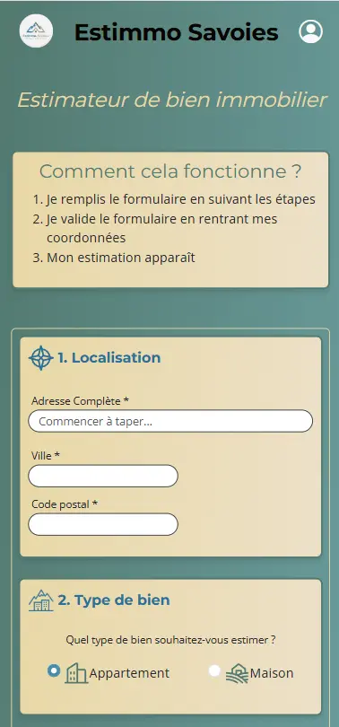
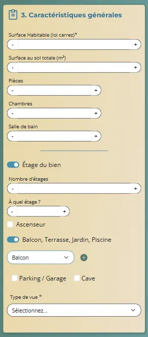
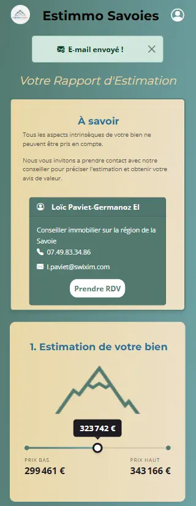
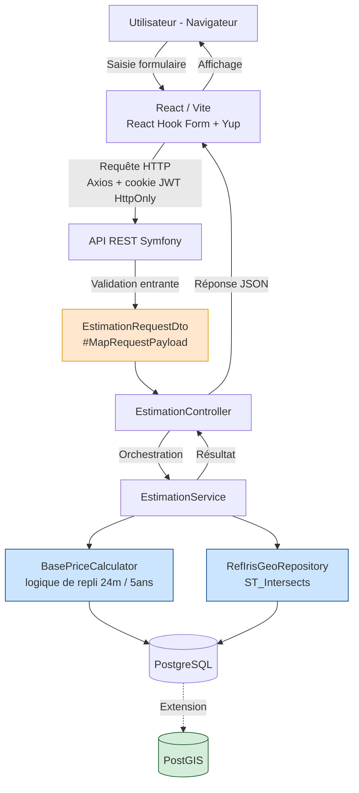

# 🏔️ Estimmo-Savoies

**Outil d'estimation immobilière sur-mesure pour le marché savoyard**

> ⚠️ **Repo de présentation** — Le code source réel appartient à un client et est hébergé sur un dépôt privé. Ce repository documente l'architecture, les choix techniques et présente des extraits de code représentatifs, avec l'accord du client.

---

Les outils d'estimation nationaux lissent les prix immobiliers à l'échelle du pays. En Savoie (73), où les écarts entre zones rurales, bassins prisés et stations de prestige sont énormes, cette approche généraliste ne convainc plus personne.

**Estimmo-Savoies** a été conçu pour un agent immobilier indépendant qui avait besoin d'un outil taillé pour son marché local — précis, rapide, et générateur de leads qualifiés.

## 🎯 Contexte & objectif métier

### Le client

Le projet a été réalisé pour un agent immobilier indépendant (statut auto-entrepreneur, affilié au réseau Swixim), opérant sur le marché immobilier savoyard (73).

### Le problème

Le marché savoyard présente de fortes disparités entre zones rurales, secteurs prisés (bassin d'Aix-les-Bains) et stations de prestige. Les outils d'estimation nationaux généralistes lissent ces écarts et produisent des marges d'erreur trop importantes pour être crédibles auprès de vendeurs locaux.

### L'objectif

Concevoir un outil d'estimation sur-mesure, basé sur des règles métier locales, capable de :
- Générer une estimation précise à partir de données réelles du secteur
- Convertir les visiteurs en **leads qualifiés** (coordonnées collectées en échange de l'estimation)
- Rester économiquement viable pour un indépendant : utilisation exclusive de sources **Open Data gratuites** (DVF, BAN, IRIS INSEE)

### Contraintes de conformité

Le projet devait intégrer dès la conception :
- **RGPD / CNIL / Bloctel** — consentement explicite, gestion des données de contact
- **Accessibilité RGAA / WCAG 2.1 niveau AA** — formulaire multi-étapes, navigation clavier
- **SEO** — optimisation ciblée de la page d'accueil (le reste de l'app étant un tunnel de conversion SPA non indexable)

  ## 📸 Aperçu

  

  
  
  

🔗 [Voir la démo en ligne](https://estimmo-savoies.fr/)

## 🛠️ Stack technique

| Couche | Technologies |
|---|---|
| **Frontend** | React (Vite) · React Hook Form + Yup · Axios · Bootstrap / Sass · Mobile-first |
| **Backend** | Symfony (API REST) · Doctrine ORM / DBAL · PHPUnit |
| **Base de données** | PostgreSQL · PostGIS (ingénierie géospatiale) |
| **Sécurité** | JWT (cookie HttpOnly, SameSite: Lax) · Pattern DTO/Mapper · Prévention IDOR |
| **Data engineering** | Croisement DVF (transactions) / BAN (adresses) / IRIS INSEE via requêtes géospatiales |
| **Déploiement** | Docker (3 conteneurs isolés) · VPS OVH Cloud (Debian) · Nginx · SSL/TLS |
| **Gestion de projet** | Méthodologie Agile (sprints 2 semaines) · Trello · Figma (maquettage mobile-first) |

## 🏗️ Architecture

**Points clés de cette architecture :**
- **Séparation stricte des responsabilités** : le `Controller` orchestre, ne calcule jamais rien lui-même — chaque service a un rôle unique (principe SRP)
- **Aucune confiance envers le client** : chaque requête entrante passe par un DTO validé (`EstimationRequestDto`) avant d'atteindre la moindre entité métier
- **Deux stratégies de repli combinées** : fiabilité statistique temporelle (`BasePriceCalculator`) et fiabilité spatiale (`RefIrisGeoRepository`), toutes deux conçues pour garantir qu'un résultat soit toujours produit malgré des données parfois incomplètes

## 🧩 Défis techniques & solutions

### 1. Fiabilité statistique sur un marché à faible volume

**Défi** — Sur certains secteurs ruraux, le nombre de transactions immobilières récentes est trop faible pour produire une moyenne de prix fiable. Une estimation basée sur 2 ou 3 ventes n'a aucune valeur statistique.

**Solution** — Une logique de repli hiérarchique en 3 niveaux (`BasePriceCalculator`) :
1. Si l'échantillon des 24 derniers mois atteint un seuil minimum de ventes → il est utilisé directement (donnée la plus actuelle)
2. Sinon, on croise avec l'échantillon à 5 ans pour calculer un **coefficient de revalorisation local**, appliqué au prix stable à 5 ans
3. En dernier recours, seul le prix à 5 ans est retourné (dernier filet de sécurité)

Cette approche garantit qu'une estimation est **toujours produite**, tout en reflétant la fiabilité réelle des données disponibles pour chaque secteur.

### 2. Rattacher une adresse à son secteur géographique

**Défi** — Une adresse saisie en texte libre (via l'API BAN) doit être rattachée à son quartier IRIS (découpage statistique INSEE) pour appliquer les bonnes données de marché local — un calcul de type "point dans un polygone" que le DQL de Doctrine ne sait pas exprimer nativement.

**Solution** — Requête SQL native utilisant la fonction spatiale PostGIS `ST_Intersects`, exécutée via la couche DBAL de Doctrine (`RefIrisGeoRepository`). Un index spatial GIST sur la colonne géométrique garantit un temps de réponse instantané malgré la complexité du calcul géographique.

### 3. Sécurisation de l'API contre la manipulation de données

**Défi** — Un formulaire multi-étapes avec des champs conditionnels (type de bien, caractéristiques variables) expose une large surface d'attaque si le backend fait confiance aux données envoyées par le client.

**Solution** — Aucune requête n'atteint directement l'entité `Estimation`. Chaque payload entrant est intercepté et validé par un DTO dédié (`EstimationRequestDto`, via l'attribut PHP 8 `#[MapRequestPayload]`), avec des contraintes de validation par champ (type, plage, regex — ex: code postal restreint au département 73). En complément, chaque accès à une ressource utilisateur passe par une vérification systématique de propriété, pour prévenir les failles IDOR (accès à une estimation appartenant à un autre utilisateur via manipulation d'ID).

### 4. Accessibilité d'un tunnel de conversion complexe

**Défi** — Un parcours en plusieurs étapes avec autocomplétion d'adresse, champs conditionnels et consentement RGPD est particulièrement exposé aux problèmes d'accessibilité (navigation clavier, lecteurs d'écran).

**Solution** — Développement guidé par les recommandations RGAA et WCAG 2.1 niveau AA, validation régulière via les outils du W3C, et tests de navigation clavier en phase de recette pour identifier les blocages de parcours.

## 💻 Extraits de code

Trois extraits représentatifs du projet, choisis pour illustrer la rigueur de sécurité côté API, la logique métier de fiabilité statistique, et l'intégration géospatiale PostGIS.

📂 [**Voir les extraits commentés →**](extraits-code/)

## 📊 Résultats

Données d'utilisation réelles depuis la mise en production :

**240 estimations réalisées**, réparties par origine :

| Origine | Volume | Détail |
|---|---|---|
| 👤 Professionnels | **105** | Usage récurrent par mon client et son réseau professionnel |
| 🏠 Particuliers | **135** | Dont **96 prospects uniques** ayant généré un lead qualifié pour mon client |

- ✅ Déployé en production sur nom de domaine dédié : [estimmo-savoies.fr](https://estimmo-savoies.fr/)
- ✅ Validé par une phase de tests utilisateurs (UAT) avec agents immobiliers et particuliers
- ✅ Sécurité maintenue via audits de dépendances réguliers (`composer audit`, `npm audit`)
